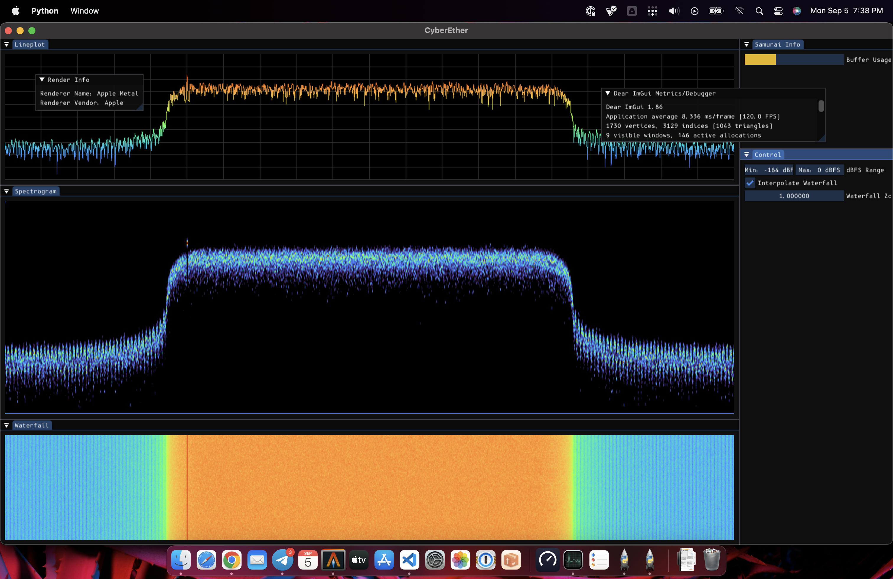

# 💨 CyberEther (Work-In-Progress)

### Portable and heterogeneously-accelerated graphical visualization for radio signals.

## Features
- 🦑 Meant to be extremely portable (NVIDIA, Apple M1/M2, Raspberry Pi, AMD).
- 🖼️ Meant to support the most common heterogeneous APIs (CUDA, Vulkan, Metal, WebGPU).
- 🔋 Runtime configurable hardware accelerated heterogeneous computing.
- 🧳 Compatible with GNU Radio with [gr-cyber](https://github.com/luigifcruz/gr-cyber).

<p align="center">

</p>

## Compatibility

### Graphical Modules
|   Module   |   Metal   |     CUDA     |     CPU+Render      |
|------------|-----------|--------------|---------------------|
| Lineplot   | ✅ (Full)  | ❌ (Porting) | ✅ (Slow but full)  |
| Waterfall  | ✅ (Full)  | ❌ (Porting) | ✅ (Slow but full)  |
| Spectogram | ✅ (Full)  | ❌ (Porting) | ✅ (Slow but full)  |

### Compute Modules
|   Module   |  CPU  |     CUDA     |   Metal   |   Vulkan   |         Description         |
|------------|-------|--------------|-----------|------------|-----------------------------|
| Amplitude  | ✅    | ❌ (Porting)  | ✅        | ❌ (Future) | Complex data to power.      |
| FFT        | ✅    | ❌ (Porting)  | ✅        | ❌ (Future) | Channelization.             |
| Multiply   | ✅    | ❌ (Porting)  | ✅        | ❌ (Future) | Vector multiplication.      |
| Scale      | ✅    | ❌ (Porting)  | ✅        | ❌ (Future) | Scaling vector by factor.   |
| Windowing  | ✅    | ❌ (Porting)  | ✅        | ❌ (Future) | Apply window to vector.     |

## Installation
The only way to use CyberEther at the moment is by compiling it from the source. It won't be that difficult because of the low number of dependencies.
See file INSTALL.md for the installation process.

### Required Dependencies
- C++20 Compiler (GCC-10 or higher)
- Meson (cmake but better)
- Ninja (make but faster)

### Optional Dependencies
- GLFW (if compiling graphical modules)
- FFTW (if compiling FFT module)
- Metal (if compiling Metal backend)
- CUDA (if compiling CUDA backend)

## Implementation Notes

### QT GUI for GNU Radio
This is currently using a GLFW window to operate, but it's totally possible for it to be rendered as a QGLSurface inside a QTApp parent (standard GNU Radio window). The idea is to write support for this as soon as the API becomes more stable.

### Development Speed
This is a side project that requires a considerable amount of work that I develop in my free time. I'm making some sacrifices to increase the speed of development like developing new features for Metal (because I have an Apple laptop) and later porting to other APIs, scarce documentation, and currently [no font rendering support](https://github.com/luigifcruz/gr-cyber/edit/main/README.md#font-rendering).

### Jetstream Render
An important goal of this project is to be as portable as possible. This requires the code to support multiple heterogeneous computing APIs (like Metal, Vulkan, OpenGL, etc). To reduce the amount of code duplication, CyberEther builds on top of a custom-built `Jetstream::Render` engine that abstracts away methods from hardware vendors into a single coherent API. This render can change from the graphical backend in runtime by a simple toggle.

```cpp
// Initialize Render
Render::Window::Config renderCfg;
renderCfg.size = {3130, 1140};
renderCfg.resizable = true;
renderCfg.imgui = true;
renderCfg.vsync = true;
renderCfg.title = "CyberEther";

// Create a render with the Metal API (Apple GPUs) backend.
Render::Initialize<Device::Metal>(renderCfg);

// -- OR --

// Create a render with the Vulkan API (Generic GPUs) backend.
Render::Initialize<Device::Vulkan>(renderCfg);
```

### Windowing System
Following the "being as much portable as possible" directive, Jetstream will render the plot into a headless framebuffer texture. This means that the buffer can be bound into a QtView or Cocoa Window. This is practical, easy to implement, and doesn't force you into our window manager. To make things easier for development, Jetstream uses glfw to create a window and display multiple plots using the ImGui windowing library. But they are not at all required! Hell, I don't know why, but if you want, you can even share the framebuffer texture with another process on Linux using [DMA-BUF](https://blaztinn.gitlab.io/post/dmabuf-texture-sharing/). Again, ImGui is only used to display the rendered frame buffer. No data plotting drawing is made with it, unlike other implementations.

### Font Rendering
Font rendering is known to be a pain to implement. This feature will require some engineering work to be implemented correctly, and once implemented will make things hard to change. Therefore, I'm choosing to put that away for the sake of development speed at this early stage of development. 

### Computing While Rendering
Sharing data with the computation pipeline while rendering requires synchronization to make sure the data is not being mutated during the presentation. This synchronization has to be precise and lightweight to not cause any stutter. This requires a mutually exclusive synchronization (compute vs present) with priority to the rendering calls. Synchronization with blocking mechanisms such as `std::conditional_variable` was [tried first](https://github.com/luigifcruz/CyberEther/blob/378f4a2289e27a8376823667ceb188f06a3ff037/subprojects/jetstream/include/jetstream/base.hpp), but these turn out to be quite slow on some types of hardware, particularly ARM devices (Jetson/RPi). The solution to this appears to be a new C++20 synchronization mechanism called `std::atomic_flags` that requires the underlying implementation to use non-blocking mechanisms. This most of the time translates to better performance but requires C++20 to work. You can check out this implementation [here](https://github.com/luigifcruz/CyberEther/blob/77094f4fc4c018f5cc78522dd19cfadec138e897/subprojects/jetstream/src/instance.cc).

### Data Handling
Turns out, you need data to display data. Our way to handle data is with the "Jetstream::Vector". This is basically the same as a `std::span` but made with heterogeneous computing in mind. The main problem with `std::span` is that you don't know where your data is local to. Sure, one can create a `std::span` with a GPU memory pointer, but how do you know that when you pass that vector forward? This requires further runtime logic to communicate the location of the buffer making things confusing. This is not an optimal place to be in an envoriment with multiple heterogeneous devices using incoherent memory. To solve this in Jetstream, the `Jetstream::Vector` requires a template `Jetstream::Device` to specify the locale of the data. For example, data inside the CUDA GPU is represented as `Vector<Device::CUDA>`. This will ensure that whoever is receiving this vector knows how to handle it properly in compile time (no runtime overhead and less code). This syntax also works in an envoriment like CUDA Unified Memory with `Vector<Device::CUDA | Device::CPU>` where the data can be accessed either from the GPU and CPU using the same pointer.

### Jetstream Compute
Sometimes, some data processing is required to display a signal. Like the render, `Jetstream::Compute` offers a way to abstract the computation away from hardware libraries (CPU, CUDA, Vulkan, Metal, etc). For this purpose, Jetstream separates computation into blocks. These blocks can be overloaded with different APIs implementations using the `Jetstrem::Device` enum. For example, below we have an FFT block with a CUDA and CPU (FFTW) implementation.

```cpp
// Performing the implementation with the CPU (FFTW) implementation.
// This expects the input buffer to be local to the CPU (Vector<Device::CPU>).
fft = Block<FFT, Device::CPU>({
    .size = stream.size(),
}, {
    .buffer = mul->getProductBuffer(),
});

// Performing the implementation with the CUDA implementation.
// This expects the input buffer to be local to the GPU (Vector<Device::CUDA>).
fft = Block<FFT, Device::CUDA>({
    .size = stream.size(),
}, {
    .buffer = mul->getProductBuffer(),
});
```

To accommodate some APIs that require initialization, the backend is initialized with the following code. This will create a global singleton class that can be accessed by a compute module to register a new kernel or to bind a compute buffer to a render texture. Multiple backends can be initialized at the same time.

```cpp
// Initialize compute API for Metal (Apple GPUs).
Jetstream::Backend::Initialize<Device::Metal>({});

// Initialize compute API for CUDA (NVIDIA GPUs).
Jetstream::Backend::Initialize<Device::CUDA>({});
```

### Wrangling Different Asynchronous Compute APIs
Every API offers a different way to synchronize work, and you can't synchronize asynchronous work from multiple different APIs at once. The CUDA way of dealing with this is using streams and Metal/Vulkan work using encoders. Honestly, this problem gives me a headache and I am still not sure how to properly handle this. But at this time, the scheduler is grouping sequential blocks that use the same API together and sequentially running them. For example, suppose a pipeline with six blocks. Blocks 1, 2, and 3 use CUDA, block 4 uses Metal, and block 5 and 6 use CUDA. The way the scheduler would handle this is to create a CUDA Graph on asynchronous stream #1, enqueue work (from B1, B2, and B3), wait for completion, create a Metal compute encoder, enqueue work (from B4), wait for completion, create a CUDA Graph on async stream #2, enqueue work (from B5, and B6), wait for completion, and repeat. It's not clear if this is the best way to deal with things, but this should make sure no computation is being done at the same time the input buffer is being read.

### Samurai
The original idea behind Samurai was to provide a better C++ interface than SoapySDR. The problem is maintaining SDR driver support is quite difficult and SoapySDR has become a standard implementation. I quite like Samurai API but I might replace it with SoapySDR in the future. Or at least, write a wrapper around SoapySDR with Samurai's API style. 

## Development Quicklogs

### September 13, 2022
Some refactoring has been recently made to support other compute APIs like Vulkan and Metal. As of now, only the Metal implementation works out-of-the-box, but a CUDA implementation from before the refactor is available and should be ported to the current upstream in the coming weeks.

## Short-Term To-Do List 

- TODO: Implement Vulkan Backend.
- TODO: Implement Vulkan Render.
- TODO: Implement Vulkan Compute.