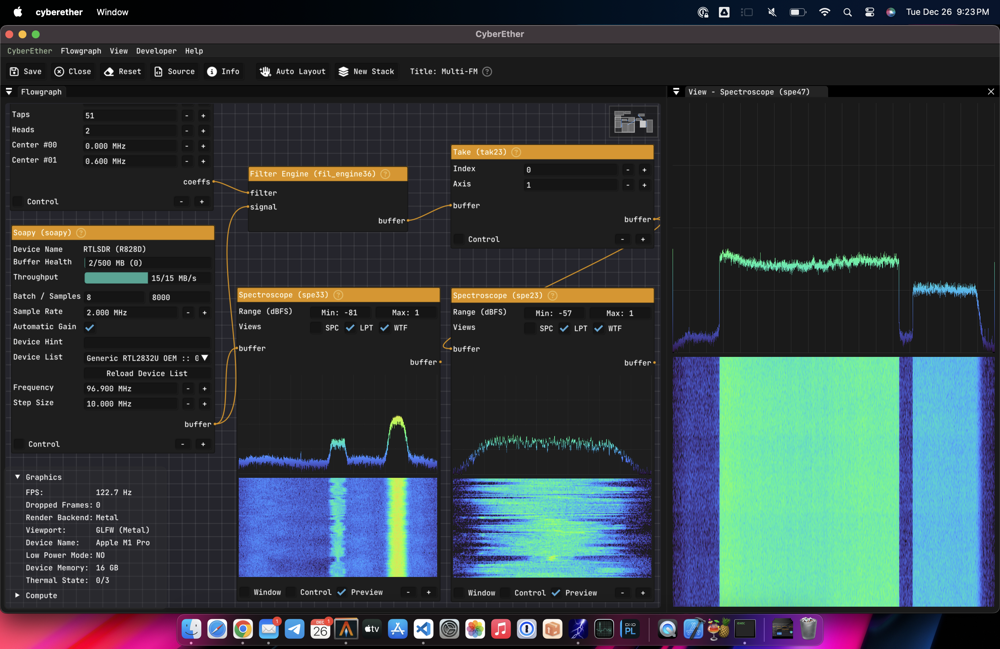

<h1 align="center"><b>⚡️ CyberEther ⚡️</b></h1>
<h3 align="center">Multi-platform GPU-accelerated interface for compute-intensive pipelines.</h3>
<br>
 
- 🖼️ Graphical support for any device with **Vulkan**, **Metal**, or **WebGPU**.
- 🦑 Portable GPU acceleration for compute: **NVIDIA (CUDA)**, **Apple (Metal)**, **Raspberry Pi (Vulkan)**, etc.
- 🔋 Runtime configurable flowgraph pipeline with heterogeneously-accelerated modular blocks.
- 🧳 **Hackable** and easy to use as a library or as a standalone application.
- 🧊 Installation-free fully-featured [web-application](https://ether.luigi.ltd) powered by **WebAssembly** and **WebGPU**.
- 🤯 Low-latency [remote interface](#remote-interface) for headless servers and edge devices.

<br>
<p align="center">

</p>

> [!WARNING]
>
> **CyberEther** is in **Alpha**. Expect bugs, missing features, and breaking changes.

CyberEther provides a flowgraph interface to build and run compute-intensive pipelines. The interface is engineered to provide a closely coupled integration between the graphical and compute blocks providing leading edge visualization capabilities. CyberEther is built on top of [Vulkan](https://www.khronos.org/vulkan/), [Metal](https://developer.apple.com/metal/), [CUDA](https://developer.nvidia.com/cuda-toolkit), and [WebGPU](https://www.w3.org/TR/webgpu/), which allows it to run on virtually any modern device. CyberEther is also designed to be easily extended with new blocks and backends. It is a great tool for prototyping and testing new ideas.

The flowgraph enables the user to build a pipeline by connecting blocks together. Each block provides a set of inputs and outputs. The inputs and outputs are connected with edges. The edges are used to transfer data between blocks. The blocks can be accelerated with any combination of backends. The user can build a pipeline with blocks that run on different devices. For example, the user can build a pipeline with a block accelerated with Vulkan followed by a block accelerated with Metal. The scheduler will transparently take care of the synchronization and memory management between the blocks and everything will run like magic!

## Compatibility

CyberEther can run in viraully any modern device with a GPU. The build system will automatically choose between the three graphical backends available (Metal, Vulkan, or WebGPU) depending on the target device. The same process applies to the compute blocks, which can be accelerated with CUDA, Metal, or Vulkan. Here is a summary of the compatible devices and backends:

|    |                Device               |       Graphics        |         Compute        |
|----|-------------------------------------|-----------------------|------------------------|
| ✅ | Apple Silicon (iPad, iPhone, Mac)   | Metal, Vulkan, WebGPU | CPU, Metal             |
| ✅ | Linux (NVIDIA)                      | Vulkan, WebGPU        | CPU, Vulkan, CUDA*     |
| ✅ | Linux (AMD, Intel)                  | Vulkan, WebGPU        | CPU, Vulkan            |
| ✅ | Raspberry Pi (4 or later)           | Vulkan, WebGPU        | CPU, Vulkan            |
| ✅ | Browser (Chrome)                    | WebGPU                | CPU, WebGPU*           |
| ✅ | Android                             | WebGPU, Vulkan*       | CPU, WebGPU*, Vulkan*  |
| ✅ | Windows (NVIDIA, AMD, Intel)*       | WebGPU, Vulkan*       | CPU, WebGPU*, Vulkan*  |

`*`: Planned for the future.

Please note that the compatibility table above is not exhaustive. Compute implementations for blocks are being added constantly. Feel free to open an issue if you want to request a specific block or device. Or even better, open a pull request with the implementation!

## Showroom
These are some examples of CyberEther running on the field. Do you have a cool demo? Tweet it with the hashtag [#CyberEther](https://twitter.com/hashtag/CyberEther) and mention [@luigifcruz](https://twitter.com/luigifcruz).

### Simple Flowgraph
This is a simple demo showing how to create a new flowgraph in CyberEther. The flowgraph is a simple pipeline with a Soapy block streaming data from a RTL-SDR dongle and a Spectroscope block visualizing the data with a waterfall and line plot.

[//]: <> (cyberether-new-flowgraph.mp4)

### Wideband Spectrum Analyzer
This is a screen-capture of CyberEther running on an MacBook Pro with M1 Pro chip. The Metal backend is being used for the graphical and compute blocks. The flowgraph is a wideband spectrum analyzer with a bandwidth of 122 MHz streaming from a [RFNM](https://rfnm.io/) software-defined radio.

[//]: <> (rfnm-spectrum-analyzer-demo.mp4)

### Multi FM Flowgraph
A fan favorite demo from my 2019 project called [CyberRadio](https://github.com/luigifcruz/CyberRadio). As the name suggests, the flowgraph is a multi-channel FM receiver. The SDR streams 2 MHz worth of the FM broadcast band and the flowgraph filters, resamples, and demodulates the signal. This flowgraph is available by default in the graphical interface examples.

[//]: <> (cyberether-multi-fm.mp4)

### Running on iPad & iPhone
This demo is running as a native iOS app and illustrates how portable CyberEther can be. The flowgraph implements a standard spectrum analyzer with waterfall and lineplot. It is running on an iPad Pro with M2 chip. But it also runs on any iPhone and Mac with Apple Silicon and iOS 14 or later. The demo also shows seamless switching between the CPU and Metal backends for individual blocks while the flowgraph is running. Bonus: CyberEther can also run in the browser!

[//]: <> (cyberether-ipad.mp4)

## Installation
The only way to use CyberEther at the moment is by compiling it from the source. But don't worry, it is not difficult! Follow the [Build From Source](#build-from-source) instructions below to compile it on your system.

## Build From Source
This shouldn't be difficult because of the low number of dependencies. CyberEther requires a C++20 compiler (>GCC-10 or >Clang 13.0), the [Meson](https://mesonbuild.com) build system, and [Ninja Build](https://ninja-build.org). Follow the instructions below to install the dependencies and build CyberEther from source.

### Step 1: Dependencies

#### Linux (Arch Linux)
Core dependencies (you probably already have them).
```bash
$ pacman -S git base-devel cmake pkg-config ninja meson git zenity
```

Graphical dependencies.
```bash
$ pacman -S spirv-cross glslang glfw
```

Vulkan backend dependencies (you probable already have them).
```bash
$ pacman -S vulkan-icd-loader vulkan-validationlayers
```

Optional dependencies.
```bash
# For SoapySDR block with RTL-SDR support.
$ pacman -S soapysdr soapysdr-rtlsdr

# For Remote capabilities.
$ pacman -S gstreamer gst-plugins-base gst-plugins-good
```

#### Linux (Ubuntu 22.04)
Core dependencies (you probably already have them).
```bash
$ apt install git build-essential cmake pkg-config ninja-build meson git zenity
```

Graphical dependencies.
```bash
$ apt install spirv-cross glslang-tools libglfw3-dev
```

Vulkan backend dependencies (you probable already have them).
```bash
$ apt install mesa-vulkan-drivers libvulkan-dev vulkan-validationlayers
```

Optional dependencies.
```bash
# For SoapySDR block with RTL-SDR support.
$ apt install libsoapysdr-dev soapysdr-module-rtlsdr

# For Remote capabilities.
$ apt install libgstreamer1.0-dev libgstreamer-plugins-base1.0-dev
```

Optional dependencies.
```bash
```

#### macOS (Apple Silicon)
This assumes [Homebrew](https://brew.sh) is installed.

Core dependencies (you probably already have them).
```bash
$ brew install cmake pkg-config ninja meson
```

Graphical dependencies.
```bash
$ brew install spirv-cross glslang glfw
```

Optional dependencies.
```bash
# For SoapySDR block with RTL-SDR support.
$ brew install soapysdr soapyrtlsdr

# For Remote capabilities.
$ brew install gst-plugins-base gst-plugins-good
```

#### Browser (Chrome)

All CyberEther runtime dependencies for the browser are included in the repository. You only need to make sure you have [Python 3](https://www.python.org), [Emscripten](https://emscripten.org/docs/getting_started/downloads.html), and [Rust Cargo](https://www.rust-lang.org/tools/install) installed.

#### iOS (iPhone & iPad)

All CyberEther dependencies for iOS are included in the repository. You only need to make sure you have the latest [Xcode](https://developer.apple.com/xcode/) installed.

### Step 2: Clone

Clone the repository from Github.
```bash
$ git clone https://github.com/luigifcruz/CyberEther.git
$ cd CyberEther
```

### Step 3: Build and Install

Follow the instructions below to build and install CyberEther on your system.

#### Linux or macOS

Build and install.
```bash
$ meson -Dbuildtype=debugoptimized build && cd build
$ ninja install
```

Done! The executable will be installed in the default terminal path. For usage instructions, run `cyberether --help`.

#### Browser (Chrome)

Build project with cross-compilation to WebAssembly.
```bash
$ meson --cross-file crosscompile/emscripten.ini -Dbuildtype=debugoptimized build-browser && cd build-browser
$ ninja
```

Copy dependencies to the build directory.
```bash
$ cp ../resources/cyberether.html .
$ cp ../resources/cyberether.png .
```

Start web server and navigate to [http://localhost:8000/cyberether.html](http://localhost:8000/cyberether.html).
```bash
$ python ../tools/local_server.py
```

#### iOS (iPhone & iPad)

Build project with cross-compilation to iOS and install binaries in the Xcode project.
```bash
$ meson --cross-file crosscompile/ios.ini -Dbuildtype=debugoptimized build-ios && cd build-ios
$ ninja install
```

After the build is complete, open the [Xcode project](./apps/ios/) and run it on your device.

## Usage
The graphical interface of CyberEther can be launched from the terminal by running `./cyberether`. The command-line interface also offers other options that can be used to configure the application. For example, enabling the headless [remote interface](#remote-interface), or running the [benchmark tool](#benchmark-tool). The full list of options can be found below.

```bash
$ ./cyberether --help
Usage: ./cyberether [options] [flowgraph]
Options:
  --headless              Enable headless mode.
  --endpoint [endpoint]   Set the endpoint of the headless viewport (`1.1.1.1:8000`, `./vid.mp4`, etc). Default: `/tmp/cyberether`
  --backend [backend]     Set the preferred backend (`Metal`, `Vulkan`, or `WebGPU`).
  --framerate [value]     Set the framerate of the headless viewport (FPS). Default: `60`
  --codec [codec]         Set the video codec of the headless viewport. Default: `FFV1`
  --size [width] [height] Set the initial size of the viewport. Default: `1920 1080`
  --scale [scale]         Set the scale of the render window. Default: `1.0`
  --benchmark [type]      Run the benchmark and output the results (`markdown`, `json`, or `csv`). Default: `markdown`
  --no-hw-acceleration    Disable hardware acceleration. Enabled otherwise.
Other Options:
  --staging-buffer [size] Set the staging buffer size (MB). Default: `32`
  --device-id [id]        Set the physical device ID. Default: `0`
  --no-validation         Disable Vulkan validation layers. Enabled otherwise.
  --no-vsync              Disable vsync. Enabled otherwise.
Other:
  --help, -h              Print this help message.
  --version, -v           Print the version.
```

### Graphical Interface
The graphical interface is where the fun is! It is a fully-featured application that can be used to build and run flowgraphs. Building a flowgraph is very familiar to anyone who has used GNU Radio Companion. Just drag the block icon from the right panel and drop them in the canvas. The color of the block icon indicates which backend to pick. For example, the Yellow block will run on the CPU, Purple on Metal, etc. Each block can be connected by dragging edges from the output of one block to the input of another. There is no start or stop button, blocks will start running as soon as they are connected. Flowgraphs can be exported and imported as readable YAML files. Example flowgraphs with helpful notes can be found pre-loaded in the application.


### Remote Interface
CyberEther can be used as a remote interface for headless servers and edge devices. The remote interface is a low-latency interface that allows the user to control the flowgraph remotely. The remote interface is built on top of [gstreamer](https://gstreamer.freedesktop.org) and uses UDP and TCP for communication. Other than video, the remote interface also sends keyboard and mouse events to the server. The example flowgraph `Remote Instance` (see image below) is available by default in the graphical interface and is a good example of how to use the remote interface.


At this time, software video encoding will be used in most platforms. Work is being done to enable hardware encoding in more devices, but this requires a lot of experimentation. Exceptions to this are NVIDIA GPUs, which will use the NVENC hardware encoder with a zero-copy framebuffer encoding, making it very nice and efficient. The Raspberry Pi will also use hardware encoding by default.

To initialize a remote instance of CyberEther, run the command below on the server. If you want lossless video, use the `--codec ffv1` option instead. The lossless video will use quite a lot of bandwidth, so make sure you have a good connection.

```bash
$ ./cyberether --headless --endpoint 0.0.0.0:5002 --codec h264
```

Note: This block will use two ports, the first one is shown in the block below (TCP:5002) for telemetry and control and a second one (UDP:5003) for data streaming. Fun fact, you can use gstreamer to receive the video stream. Detailed instructions on how to do this can be found [here](./docs/remote-headless-mode.md).

### Benchmark Tool
CyberEther comes with a neat runtime benchmark tool that can be used to compare the performance of different backends and modules. There are two ways to use it, either through the graphical interface or by running the command line tool. The graphical interface is the easiest way to use it. To access it, click on the `Developer` menu and then click on `Open Benchmarking Tool`. A new window will open (see image below) and the benchmark can be started by clicking on the `Run Benchmark` button. The results will be displayed in a table.


The benchmarking tool can also be run from the command line in headless mode. To do this, run the command below. The results will be printed in the terminal. The format of the results can be changed by specifying `csv`, `json`, or `markdown` after the `--benchmark` option. For example, `--benchmark csv`.

```bash
$ JST_DEBUG=2 ./cyberether --benchmark 
```

### Examples
Another option other than using the graphical interface is to use CyberEther as a library for your own application. The library is designed to be easily integrated and hackable. The [examples](./examples/) directory contains a few examples to get you started. At the moment, the main focus of the project is to continue to improve the graphical interface, but the standalone features will be improved in the future as things stabilize.

## Frequently Asked Questions

#### Q. Why is CyberEther written in C++?
The short answer to this question is that compatibility is king. The longer answer is that one of the design choices is to be as low-level as possible. This allows me to have full control over the code and to be able to optimize it for a specific platform without being locked down by a framework. That is why CyberEther can run inside the browser while being able to scale towards a supercomputer. Currently, one of the problems with other languages is that they have too many wrappers and abstractions that make it difficult to debug and optimize the code. I expect this to change in the future as first-party support grows but for now, C++ is the best option. As John Carmack once said, "[...] externalities that can overwhelm the benefits of a language [...]". I am also a big fan of Rust and I am looking forward to find a good project to use it in the future.

#### Q. What is the best way to contribute to the project?
The code is riddled with TODO comments. These are a good place to start. Another way to contribute is by implementing new blocks and modules.

#### Q. Why CyberEther uses Jetstream as namespace?
In the beginning of the project, CyberEther was meant to be only a application that utilized Jetstream as a library. But as the project evolved, the two things became one. In the end, I decided to keep Jetstream as the name of the library and CyberEther as the name of the application.

#### Q. How CyberEther compares to GNU Radio?
First of all, GNU Radio is an amazing project. It is a very powerful tool and it is used by many people and institutions around the world. Developing CyberEther as a separate project without the burden of backwards compatibility and legacy code allowed me to explore new ideas that would be time-consuming to implement in GNU Radio. I think of CyberEther as a playground for new ideas that can be later integrated into GNU Radio if they prove to be useful. Beyond radio, CyberEther has the potential to be used in other domains such as machine learning, computer vision, and robotics. The goal is to make CyberEther a general-purpose acceleration tool for compute-intensive pipelines.

#### Q. What are the future plans for CyberEther?
The future plans for CyberEther include adding unit tests, improving documentation, and implementing new blocks and modules. The goal is to continue expanding the capabilities of CyberEther beyond radio communications and make it a powerful tool for accelerating compute-intensive pipelines in various domains.

#### Q. What are the minimum requirements to run CyberEther?
There are no minimum requirements, only minimum expectations.

#### Q. Where are the easter eggs?
There are no easter eggs in CyberEther. I promise.

## About
CyberEther was created in 2021 by [Luigi Cruz](https://luigi.ltd) as a personal project. The project is still in its early stages and it is being developed in the open and contributions are welcome. Regular talks about CyberEther were given at previous GNU Radio Conference editions and are available [here](https://luigi.ltd/talks/).

## Contributing
Contributions are welcome! Pull requests are the best way to propose changes to the codebase. We actively welcome your pull requests and invite you to submit pull requests directly in this repository. The library follows the [Google C++ Code Style Guide](https://google.github.io/styleguide/cppguide.html). The default line length is 88. This can be overridden if necessary. Please, be sensible. Also keep in mind that since this project is still in its early stages, the API is not stable and it is subject to change.