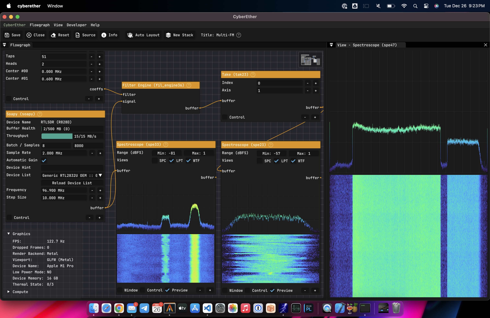

<h1 align="center"><b>⚡️ CyberEther ⚡️</b></h1>
<h3 align="center">A multi-platform GPU-accelerated signal processing framework.</h3>

<a href="https://cyberether.org">Website</a> |
<a href="https://cyberether.org/web">Try Online</a> |
<a href="https://cyberether.org/docs">Docs</a> |
<a href="https://cyberether.org/docs/installation">Installation</a> |
<a href="https://cyberether.org/docs/faq">FAQ</a> |
<a href="https://cyberether.org/docs/contributing">Contributing</a>

 

CyberEther is a high-performance GPU-accelerated framework for real-time signal visualization and data processing. It leverages low-level graphics APIs to achieve native performance on any platform.

- 🎨 Graphical support for any device with **Vulkan**, **Metal**, or **WebGPU**.
- 🌐 Installation-free fully-featured web application powered by **WASM** and **WebGPU**.
- 📡 Low-latency **remote interface** for headless servers and edge devices.
- 🔀 Modern **flowgraph editor** for building and running real-time pipelines.
- 🐍 Python API for custom signal visualization via **Superluminal**.

<samp>More demos on the website: <a href="https://cyberether.org">cyberether.org</a></samp>

## Compatibility

CyberEther can run in virtually any modern device with a graphics card. The build system will automatically choose between the three graphical backends available (Metal, Vulkan, or WebGPU) depending on the target device.

The development of compute for CUDA, Vulkan, and WebGPU is currently in progress.

See the current compatibility table in the [Overview](https://cyberether.org/docs/overview).

## Installation

CyberEther runs on macOS, Linux, Windows, iOS/iPadOS, Android, Raspberry Pi, and the browser. It is currently installed by building from source, but more installation methods are coming soon.

- [**Try Online**](https://cyberether.org/web): Run the browser build powered by **WebAssembly** and **WebGPU**.
- [**Build From Source**](https://cyberether.org/docs/installation): Follow the dependency and build guide.

## FAQ

This page answers some of the most common questions about CyberEther. If you have a question that is not answered there, feel free to open an issue on GitHub.

See: [FAQ](https://cyberether.org/docs/faq)

## Contributing

Contributions are welcome! Pull requests are the best way to propose changes to the codebase. We actively welcome your pull requests and invite you to submit pull requests directly in this repository.

Keep in mind that since this project is still in its early stages, the API is not stable and it is subject to change.

Guidelines are documented here: [Contributing](https://cyberether.org/docs/contributing)

## License

CyberEther is distributed under the [MIT License](https://cyberether.org/docs/license). All contributions are considered to be licensed under the same terms. The use of the "CyberEther" name requires prior authorization.

A list of third-party software and their licenses can be found on the [Acknowledgments](https://cyberether.org/docs/acknowledgments) page.

## About

CyberEther was created in 2021 by [Luigi Cruz](https://luigi.ltd) as a personal project. Regular talks about CyberEther were given at previous GNU Radio Conference editions and are available [here](https://luigi.ltd/talks/).
